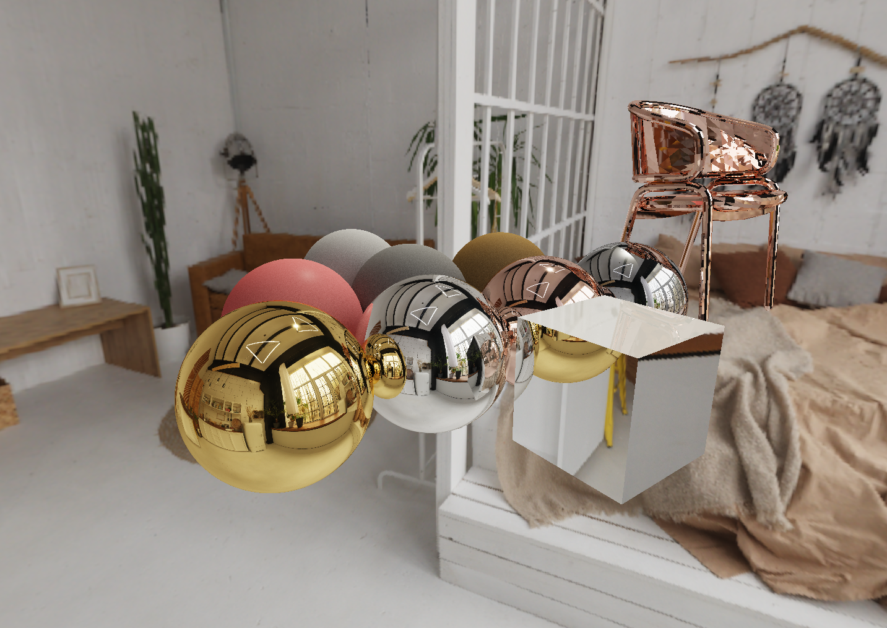

# Simple Path Tracer (CPU Embree + GPU OptiX)

A lightweight physically-based path tracing renderer with **CPU and GPU backends**, focused on clarity, correctness, and experimentation.

---
## Features

## Overview

This project implements a Monte Carlo path tracer with two rendering backends:

- **CPU backend** using **Intel Embree 4** and **TBB**
- **GPU backend** using **NVIDIA OptiX** with a **wavefront-style pipeline**

The CPU implementation serves as a reference, while the GPU backend is designed for performance exploration and learning modern GPU path tracing architecture.

---

## Features

### Rendering
- Monte Carlo path tracing
- Progressive accumulation
- Physically-based materials (diffuse / metal / dielectric / emissive)
- Environment lighting (procedural sky + optional HDR environment map)
- Directional light support (GPU)
- Resolve stage with **tonemapping + gamma correction**

### Backends
**CPU (Embree + TBB)**
- High-quality BVH traversal via Embree
- Tile-based rendering
- Multi-core parallelism with TBB

**GPU (OptiX)**
- OptiX ray traversal and intersection
- Wavefront-style path tracing (trace → shade → resolve)
- Explicit path state and queues
- Designed for further divergence reduction and queue classification

---

## Controls

### Camera
- **W / A / S / D** – move camera
- **Mouse** – look around
- **ESC** – exit

### Backend Switching
- **G** – toggle rendering backend  
  - CPU Embree path tracer  
  - GPU OptiX wavefront path tracer  

Switching backends resets accumulation automatically.

---

## Rendering Pipeline (High Level)

### CPU Backend
1. Scene setup
2. Embree BVH build
3. TBB tile dispatch
4. Path tracing
5. Progressive accumulation
6. Tonemap + gamma
7. Display

### GPU Backend (OptiX)
1. Ray generation / path initialization
2. OptiX trace → hit records
3. Shade stage (hit / miss, materials, environment, direct light)
4. Accumulation
5. Resolve stage:
   - average samples
   - tonemapping
   - gamma correction
6. Display

---

## Color & Brightness Notes

The renderer accumulates **linear HDR radiance**.

Final output is produced in the resolve stage using:
- exposure scaling
- tonemapping (e.g. Reinhard)
- gamma correction (sRGB, 1/2.2)

If the image appears too dark or too bright, adjust **exposure or environment intensity**, not BRDF parameters.

---

## Build

### Requirements
- Windows + Visual Studio 2019/2022
- CMake 3.20+
- vcpkg
- CUDA Toolkit (for GPU backend)
- NVIDIA OptiX SDK (for GPU backend)

### Dependencies (vcpkg)
```bash
vcpkg install embree glm glfw3 glew tbb stb
